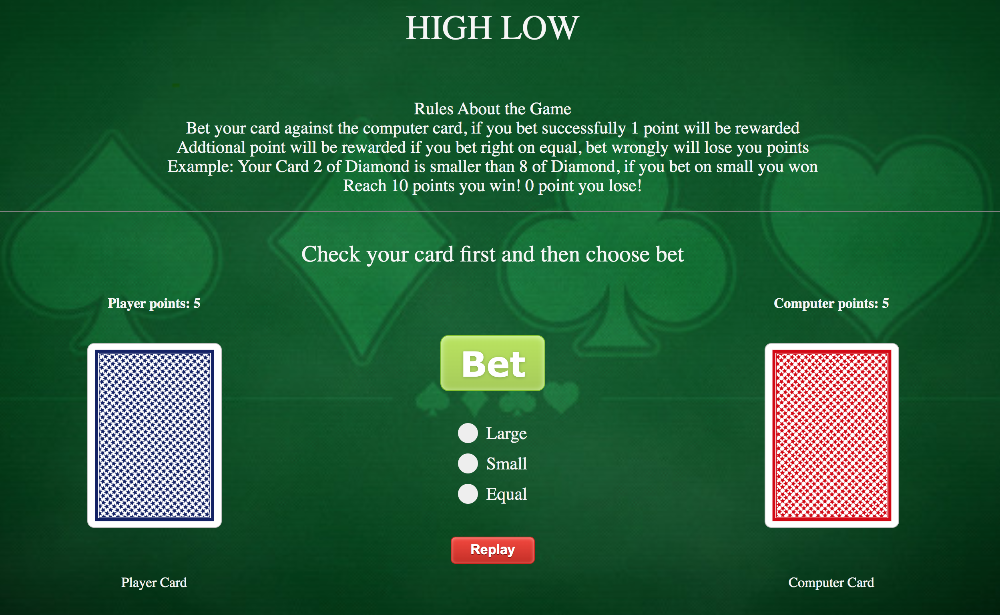

 # Game: HighLow

You have 5 point at the start of the adventure. You will check your card first and carefully bet against computer. If you bet correctly, you gain a point. If you dare to take more risk in betting equal, you will be greatly rewarded. However, if you bet wrongly, points will be deducted. Good luck on your adventure!

## Screenshot

----
## Technologies Used: JavaScript, HTML, CSS

## Getting Started

[Here is my game](https://wangxiaolialina.github.io/sei-project-1/)

## Next Steps: 

1. Add more betting options
2. A more interesting betting system
3. Add animation to improve user experience
